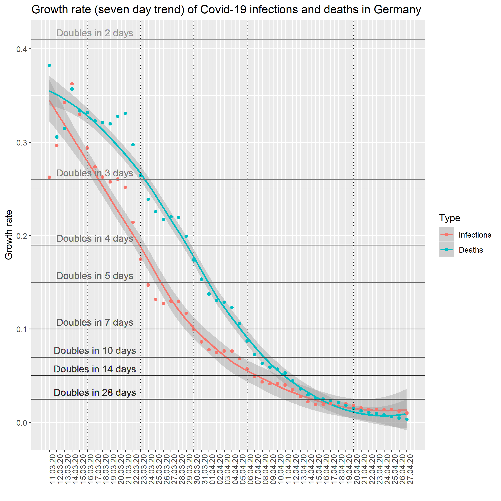
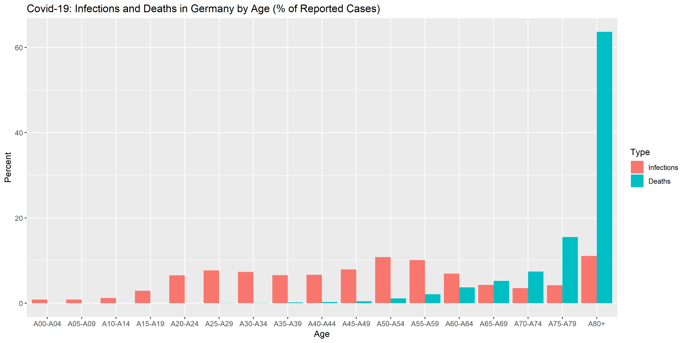

# COVID-19: Cases and Deaths in Germany

*Last update: 29 April 2020*

This article presents a brief overview of the current development of known COVID-19 cases/deaths in Germany. I investigate the rate of growth of newly reported infections/deaths and look at short term development. Find the R source file [here](https://github.com/Bixi81/COVID-19/blob/master/covid_19_county_data_germany.r).

**1. Current Situation**

Data on known COVID-19 cases in Germany are currently published daily by the [Robert Koch-Institut (RKI)](https://www.rki.de/DE/Content/InfAZ/N/Neuartiges_Coronavirus/Fallzahlen.html).

**Find time series data on reported cases and deaths in Germany** [here](https://github.com/Bixi81/COVID-19/blob/master/covid19_germany.csv). This data is based on detailed county/patient level data as published by RKI daily [here](https://npgeo-corona-npgeo-de.hub.arcgis.com/datasets/dd4580c810204019a7b8eb3e0b329dd6_0). R source code [here](https://github.com/Bixi81/COVID-19/blob/master/covid_19_county_data_germany.r).

Around 16 March 2020, first precautionary measures have been taken on a broader scale by German States (Bundesländer), including official recommendations to stay at home if possible and to avoid unnecessary travels. From 21 March 2020 onwards, stronger regulation is in place in two States (Bayern, Saarland), basically limitating freedom of movement for most people. 

Starting 23 March 2020, similar restrictions have been implemented all over Germany. These restrictions include a ban on gatherings of more than two people in the public. All restaurants and bars and most of shops are closed. All events are called off including sport events, concerts etc. Schools and universities are closed. Many factories are closed (including car makers such as Daimler, BMW, Volkswagen). Many office workers work from home. These restrictions will stay in force at least until 20 April 2020, according to the Bundesregierung (as of 28 March 2020).

The testing capacity in Germany is about 360,000 per week, according to the German ministry of health. About 10% of tested persons are tested positive (as of 28 March 2020).

As of 30 March, according to [Deutsche Krankenhausgesellschaft (DKG)](https://www.dkgev.de/dkg/coronavirus-fakten-und-infos/), 7000 people are treated in hospitals in Germany because of Covid-19 infections. 1500 of the 7000 are in intensive care and 1100 are treated using ventilators. Also according to the DKG, the capacity of intensive care in Germany before Covid-19 was 28000, 20000 of which with ventilators. As of 30 March, the capacity has been increased to 40000 with 30.000 ventilators. A newly installed register gives an overview of intensive care capacities in use: [DIVI Intensivregister](https://www.intensivregister.de/#/intensivregister).

As of 31 March, the lethality of Covid-19 in Germany is about 0.8 percent according to RKI. The lethality is expected to increase within the next weeks in case more elderly are infected by Covid-19 and/or in case the number of treated patients rises. Information from South Korea imply that the lethality of Covid-19 is about 1.1%. The figure is based on broad testing in South Korea, which allows a relatively accurate assessment of the overall number of infections. After correction for the age distribution, the lethality observed in South Korea could translate to a lethality of about 1.3% in Germany.

As of 3 April, about 2300 of medical staff in German hospitals are infected with Covid-19, according to the Newspaper "Süddeutsche Zeitung" which cites RKI sources.

As of 4 April 2020, according to German [media reports](https://www.swr.de/swraktuell/corona-testkapazitaeten-gesteigert-100.html), the Covid-19 test capacity in Germany currently amounts to 100000 per day, compared to 7000 per day in early March. In South Korea, about 400000 people are tested daily.

5 April 2020: Germany's chancellery minister Helge Braun - according to media reports - says that new infections must not double in less than 10 to 14 days, in order for the German health sector, to cope with the number of patients. 

10 April 2020: The Austrian Government has conducted [Covid-19 tests](https://www.nzz.ch/wissenschaft/coronavirus-test-oesterreich-und-nrw-leisten-pionierarbeit-ld.1551267) on 1544 individuals on 6 April. The test results suggest that between 0.12 and 0.76 percent of the population carry the virus. This would be 28500 people in total (expected value) - about 2.3 times of known infections in Austria [as of 6 April](https://info.gesundheitsministerium.at).

13 April 2020: According to preliminary results of a study by Hendrik Streeck et al. in the German county of Heinsberg - one of the most affected counties in Germany - the lethality of Covid-19 is [about 0.37 percent](https://www.tagesspiegel.de/wissen/virologe-streeck-zur-coronavirus-studie-die-veroeffentlichung-zu-heinsberg-war-nicht-leichtfertig/25735672.html) in the region. The lethality of influenza is between 0.1 and 0.2 percent [according to RKI](https://www.aerzteblatt.de/nachrichten/109704/Robert-Koch-Institut-Sars-CoV-2-toedlicher-als-Influenzavirus).

15 April 2020: The federal government (Bundesregierung) proposes to the states (Bundesländer), that public restrictions including closure of shops, bars, restaurants, schools, a ban on public gatherings and events, closure of most borders (except for commuters and goods), should keep in force until at least 3 May 2020. These restrictions have been in force sind 23 March 2020. The detailed implementation in many aspects (e.g. closure of schools and shops) is the responsibility of the States (Bundesländer).

19 April 2020: Antibody tests in Santa Clara county (USA), carried out by researchers from Stanford University, suggest that Covid-19 cases in the county are underreported by a factor between 55-85: "Researchers estimate that if 2.5 to 4.2 percent of the county has already been infected, the true number of total cases in early April — both active and recovered — ranges between 48,000 and 81,000. The county had reported just under 1,000 cases at the time the study was conducted". [Source](https://www.sfgate.com/news/editorspicks/article/Santa-Clara-antibody-test-coronavirus-results-case-15208216.php?fbclid=IwAR2EZv9UpD2CSN5wMsn3hhAHsAxL5Tru5PLaui6EMgPH-2wKwuW_ZcguwB8).

As of [20 April 2020](https://web.archive.org/web/20200422070907/https://www.bundesregierung.de/breg-de/themen/coronavirus/corona-massnahmen-1734724), shops with up 800 sqm sale area are allowed to open for business from 20 April onwards. Independent of size, car and bicycle vendors as well as book shops are allowed to open. Bars and restaurants are still closed. These restrictions will remain in force until 3 May. Larger scale public events (concerts, sport events etc) will be banned until 31 August 2020 as of 20 April.

As of 27 April 2020, [face masks must be worn on a mandatory basis](https://web.archive.org/web/20200422122320/https://www.nzz.ch/international/erste-klinische-pruefung-eines-impfstoffs-in-deutschland-steht-offenbar-bevor-immer-mehr-laender-fuehren-eine-maskenpflicht-ein-die-neusten-entwicklungen-zum-coronavirus-in-deutschland-ld.1543011) in all German states in shops and public transport ("Maskenpflicht"). Starting 20 April (Sachsen), masks will gradually become mandatory in all states (23 April, Sachsen-Anhalt; 24 April, Thüringen; 27 April Bayern, Hessen, Bremen / Berlin, Brandenburg, M-Vorpommern (only public transport); 29 April Schleswig-H).

**2. Overall Trends**

The figure below shows growth rates of newly discovered/reported infections/deaths (estimated over a seven day "lookback" period) over time. Find a time series of growth rates [here](https://github.com/Bixi81/COVID-19/blob/master/covid19_growth_rates_germany.csv).

**3. Deaths and Known Infections by Age**

[RKI](https://npgeo-corona-npgeo-de.hub.arcgis.com/datasets/dd4580c810204019a7b8eb3e0b329dd6_0) now provides more detailed information regarding the age of infected/deceased persons. As of 29 April 2020, the distribution of infections/deaths by age group is:

| Age  | Infections (%) | Deaths (%) |
| --- | --- | --- |
| 0-4   | 0.9  | 0.0 |
| 5-9   | 0.9  | 0.0 |
| 10-14 | 1.2  | 0.0 |
| 15-19 | 2.9  | 0.0 |
| 20-24 | 6.6  | 0.0 |
| 25-29 | 7.7  | 0.1 |
| 30-34 | 7.4  | 0.0 |
| 35-39 | 6.6  | 0.2 |
| 40-44 | 6.7  | 0.3 |
| 45-49 | 7.9  | 0.5 |
| 50-54 | 10.8 | 1.1 |
| 55-59 | 10.1 | 2.1 |
| 60-64 | 7.0  | 3.7 |
| 65-69 | 4.3  | 5.3 |
| 70-74 | 3.6  | 7.4 |
| 75-79 | 4.2  | 15.6 |
| 80+   | 11.0 | 63.6 |

---

**4. Official Statements**

**4.1 Gefahreninformation 22.04.2020 13:29**

[Gefahreninformation](https://warnungen.katwarn.de/)
BBK, Nationale Warnzentrale Bonn meldet: Coronavirus: Informationen des Bundesministeriums für Gesundheit zur Erweiterung der Leitlinien zur Beschränkung von sozialen Kontakten vom 22.04.2020 13:29.
BBK, Nationale Warnzentrale Bonn meldet: Die Bundesregierung informiert: Aufgrund neuer Informationen wird die Meldung vom 20.04.2020 aktualisiert.
Aktualisierte Inhalte:
Handlungsempfehlungen: Telefonischen Anforderung einer Arbeitsunfähigkeitsbescheinigung

Diese Gefahreninformation gilt für ganz Deutschland. Maßgeblich für die in Ihrem Bundesland geltenden Regelungen sind die Festlegungen der Landesregierungen. Bitte beachten Sie hierzu die Meldungen Ihres jeweiligen Bundeslandes. Diese finden Sie in der Warn-App NINA unter Notfalltipps zu Corona im Unterabschnitt "Hotlinenummern der Landesregierungen".

Aufgrund des Beschlusses des Gemeinsamen Bundesausschusses der Ärzte und Krankenkassen vom 21.04.2020 zur Arbeitsunfähigkeits-Richtlinie (Anpassung und Verlängerung der Ausnahmeregelungen zur telefonischen Feststellung von Arbeitsunfähigkeit) können Sie bis zum 04. Mai 2020 bei leichten Erkrankungen der oberen Atemwege, die keine schwere Symptomatik vorweisen (Husten/Schnupfen), Arbeitsunfähigkeitsbescheinigungen für einen Zeitraum von bis zu 7 Kalendertagen telefonisch bei Ihrem Hausarzt/Ihrer Hausärztin erhalten.

Die hohe Dynamik der Verbreitung des Coronavirus (SARS-CoV-2) in Deutschland in der ersten Märzhälfte hat einschneidende Beschränkungen erfordert. Dadurch wurde erreicht, dass die Infektionsgeschwindigkeit in Deutschland abgenommen hat. Da ohne Beschränkungen die Infektionsgeschwindigkeit sehr schnell wieder zunimmt, können wir noch nicht zum gewohnten Leben der Zeit vor der Epidemie zurückkehren.

Die Bundeskanzlerin und die Regierungschefinnen und Regierungschefs der Länder haben am 15.04.2020 folgendes beschlossen:

- Öffnung von Schulen ab dem 4. Mai 2020 für die Schülerinnen und Schüler der Abschlussklassen dieses Schuljahres und der qualifikationsrelevanten Jahrgänge der allgemeinbildenden sowie berufsbildenden Schulen, die im nächsten Schuljahr ihre Prüfungen ablegen, sowie für die Schülerinnen und Schüler, die in der letzten Klasse der Grundschule beschult werden (ggf. abweichende Regelungen in Ihrem Bundesland). Die Schulträger sind aufgerufen, die hygienischen Voraussetzungen vor Ort zu schaffen und dauerhaft sicherzustellen.
- Die Notbetreuung wird fortgesetzt und auf weitere Berufs- und Bedarfsgruppen ausgeweitet.
- Geschäfte bis zu 800 qm Verkaufsfläche sowie unabhängig von der Verkaufsfläche Kfz-Händler, Fahrradhändler, Buchhandlungen können unter Auflagen zur Hygiene, zur Steuerung des Zutritts und zur Vermeidung von Warteschlangen wieder öffnen.
- Friseurbetriebe können unter Auflagen zur Hygiene, zur Steuerung des Zutritts und zur Vermeidung von Warteschlangen sowie unter Nutzung von persönlicher Schutzausrüstung den Betrieb ab dem 4. Mai 2020 wieder aufzunehmen
- den Bürgerinnen und Bürgern wird die Nutzung entsprechender Alltagsmasken insbesondere im öffentlichen Personennahverkehr und beim Einkauf im Einzelhandel dringend empfohlen.
- Großveranstaltungen bleiben bis mindestens bis zum 31. August 2020 untersagt.

Bis auf die aufgeführten Lockerungen bleiben die gemeinsamen Beschlüsse vom 12., 16. und 22. März 2020 sowie die begleitenden ChefBK/CdS-Beschlüsse sowie die Entscheidungen des Corona-Kabinetts weiterhin gültig. Die daraufhin getroffenen Verfügungen werden bis zum 3. Mai 2020 verlängert:
- 1. Die Bürgerinnen und Bürger werden angehalten, die Kontakte zu anderen Menschen außerhalb der Angehörigen des eigenen Hausstands auf ein absolut nötiges Minimum zu reduzieren.
- 2. In der Öffentlichkeit ist, wo immer möglich, zu anderen als den unter 1. genannten Personen ein Mindestabstand von mindestens 1,5 m einzuhalten.
- 3. Der Aufenthalt im öffentlichen Raum ist nur alleine, mit einer weiteren nicht im Haushalt lebenden Person oder im Kreis der Angehörigen des eigenen Hausstands gestattet.
- 4. Der Weg zur Arbeit, zur Notbetreuung, Einkäufe, Arztbesuche, Teilnahme an Sitzungen, erforderliche Terminen und Prüfungen, Hilfe für andere oder individueller Sport und Bewegung an der frischen Luft sowie andere notwendige Tätigkeiten bleiben weiter möglich.
- 5. Gruppen feiernder Menschen auf öffentlichen Plätzen, in Wohnungen sowie privaten Einrichtungen sind angesichts der ernsten Lage in unserem Land inakzeptabel. Verstöße gegen die Kontakt-Beschränkungen sollen von den Ordnungsbehörden und der Polizei überwacht und bei Zuwiderhandlungen sanktioniert werden.
- 6. Gastronomiebetriebe bleiben geschlossen. Davon ausgenommen ist die Lieferung und Abholung mitnahmefähiger Speisen für den Verzehr zu Hause.
- 7. Dienstleistungsbetriebe im Bereich der Körperpflege, wie Friseure, Kosmetikstudios, Massagesalons, Tattoo-Studios und ähnliche Betriebe bleiben geschlossen (Friseure bis zum 04. Mai 2020), weil in diesem Bereich eine körperliche Nähe unabdingbar ist. Medizinisch notwendige Behandlungen bleiben weiter möglich.
- 8. In allen Betrieben und insbesondere solchen mit Publikumsverkehr ist es wichtig, die Hygienevorschriften einzuhalten und wirksame Schutzmaßnahmen für Mitarbeiter und Besucher umzusetzen.

- Bund und Länder werden bei der Umsetzung dieser Einschränkungen sowie der Beurteilung Ihrer Wirksamkeit eng zusammenarbeiten. Weitergehende Regelungen aufgrund von regionalen Besonderheiten oder epidemiologischen Lagen in den Ländern und Landkreisen bleiben möglich.

Hinweise:
Vermeiden Sie Aktivitäten in der Gruppe wie Teamsportarten. - Bitte folgen Sie den behördlichen Anordnungen. - Bitte bleiben Sie zu Hause, soweit es Ihnen möglich ist. Wir als Gemeinschaft müssen Solidarität zeigen denen gegenüber, die besonders gefährdet sind. - Beachten Sie unbedingt behördliche Anordnungen. - Wenn Sie aus dem Ausland nach Deutschland zurückgekehrt sind, vermeiden Sie unnötige Kontakte und bleiben Sie zwei Wochen zu Hause - und zwar unabhängig davon, ob Sie Krankheitszeichen zeigen oder nicht. - Beachten Sie wichtige Hygieneregeln wie regelmäßiges und gründliches Händewaschen. - Husten und niesen Sie in ein Taschentuch oder in die Armbeuge. - Vermeiden Sie Körperkontakt mit anderen Personen wie Begrüßungsküsse und Händeschütteln. - Seien Sie kritisch: Informieren Sie sich nur aus gesicherten Quellen. - Helfen Sie älteren Mitbürgerinnen und Mitbürgern, damit diese keinen vermeidbaren Risiken ausgesetzt werden: Kaufen Sie zum Beispiel für sie ein. - Wenn Sie an einer Immunschwäche oder einer chronischen Atemwegserkrankung leiden oder wenn Sie älter als 70 Jahre sind, empfiehlt es sich, sich von Ihrem Hausarzt bzw. ihrer Hausärztin über eine Pneumokokkenimpfung beraten zu lassen. - Wenn Sie selbst Krankheitszeichen bei sich feststellen, nehmen Sie telefonisch Kontakt mit Ihrem Hausarzt/Ihrer Hausärztin auf oder wenden sich an die Telefonnummer 116117 des Ärztlichen Bereitschaftsdienstes. Gehen Sie nicht unaufgefordert in eine Arztpraxis oder ins Krankenhaus.

