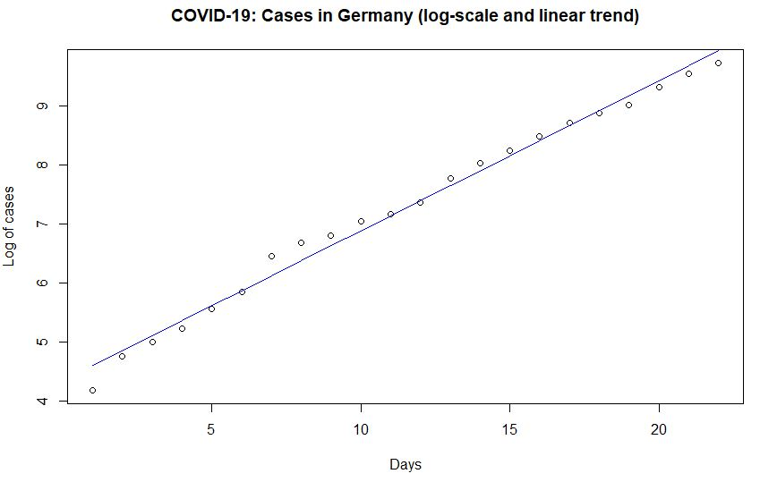

# COVID-19 Cases in Germany

This article presents a brief overview of the current development of COVID-19 cases in Germany as of 21 March 2020. I identify the rate of growth in new infections per day and look at short term development of cases (overall numer of infected people) under different growth assumtions.

**1. Data and Basic Trends**

Data on COVID-19 cases are currently published daily by [Robert Koch-Institut (RKI)](https://www.rki.de/DE/Content/InfAZ/N/Neuartiges_Coronavirus/Fallzahlen.html).


|Date| Cases| 
|---|---|
|  2020-02-29  |     66|
|  2020-03-01  |    117|
|  2020-03-02   |   150|
|  2020-03-03    |  188|
|  2020-03-04   |   262|
|  2020-03-05   |   349|
|  2020-03-06   |   639|
|  2020-03-07   |   795|
|  2020-03-08   |   902|
| 2020-03-09    | 1139|
| 2020-03-10    | 1296|
| 2020-03-11    | 1567|
| 2020-03-12|     2369|
| 2020-03-13|     3062|
| 2020-03-14|     3795|
| 2020-03-15|     4838|
| 2020-03-16|     6012|
| 2020-03-17|     7156|
| 2020-03-18|     8198|
| 2020-03-19|    10999|
| 2020-03-20|    13957|
| 2020-03-21|    16662|

Around March 16th, first precautionary measures have been taken on a broader scale by German States (Bundesländer), including official recommendations to stay at home if possible and to avoid unnecessary travels. From March 21th onwards stronger regulation is in place in two States (Bayern, Saarland), basically restricting freedom of movement for most people.

Between February 29th and March 21st, the growth of cases showed a linear trend over time on a semi-log scale.




**2. Linear Regression**

It is easy to get an estimate of the current growth of COVID-19 infections in Germany. Simply run a linear regression on the log of cases (y) with the number of days on the right hand side of the equation (x).

=\beta_0&space;&plus;&space;\beta_1&space;x&space;&plus;&space;u.)

The regression results are:

```
Coefficients:
            Estimate Std. Error t value Pr(>|t|)    
(Intercept) 4.350969   0.077251   56.32   <2e-16 ***
ntime       0.253310   0.005882   43.07   <2e-16 ***
---
Signif. codes:  0 ‘***’ 0.001 ‘**’ 0.01 ‘*’ 0.05 ‘.’ 0.1 ‘ ’ 1

Residual standard error: 0.175 on 20 degrees of freedom
Multiple R-squared:  0.9893,	Adjusted R-squared:  0.9888 
F-statistic:  1855 on 1 and 20 DF,  p-value: < 2.2e-16
```

The results imply that the growth rate of COVID-19 cases in Germany over the last 22 days was about 29% [on average](https://www.uni-regensburg.de/wirtschaftswissenschaften/vwl-tschernig/medien/mitarbeiter/rameseder/interpretation.pdf).


**3. Prediction**

df

**4. Conclusion**

dsfv
