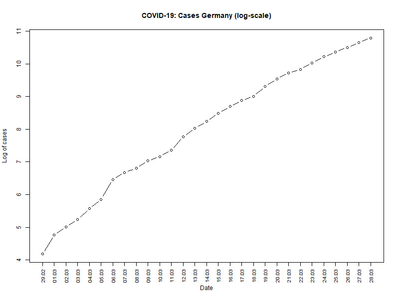
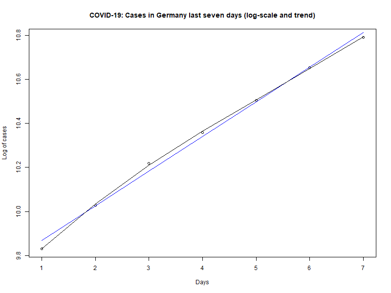

# COVID-19 Cases in Germany

Last update: 28 March 2020

This article presents a brief overview of the current development of COVID-19 cases in Germany. I investigate the rate of growth of newly discovered/reported infections in Germany and look at short term development of cases, assuming an unchanged growth rate. Find the R source code [here](https://github.com/Bixi81/COVID-19/blob/master/2020_03_28_covid19.r).

**1. Current Situation**

Data on known COVID-19 cases in Germany are currently published daily by the [Robert Koch-Institut (RKI)](https://www.rki.de/DE/Content/InfAZ/N/Neuartiges_Coronavirus/Fallzahlen.html).


|Date| Cases| 
|---|---|
|  2020-02-29  |     66|
|  2020-03-01  |    117|
|  2020-03-02   |   150|
|  2020-03-03   |   188|
|  2020-03-04   |   262|
|  2020-03-05   |   349|
|  2020-03-06   |   639|
|  2020-03-07   |   795|
|  2020-03-08   |   902|
| 2020-03-09    | 1139|
| 2020-03-10    | 1296|
| 2020-03-11    | 1567|
| 2020-03-12|     2369|
| 2020-03-13|     3062|
| 2020-03-14|     3795|
| 2020-03-15|     4838|
| 2020-03-16|     6012|
| 2020-03-17|     7156|
| 2020-03-18|     8198|
| 2020-03-19|    10999|
| 2020-03-20|    13957|
| 2020-03-21|    16662|
| 2020-03-22|    18610|    
| 2020-03-23|    22672|    
| 2020-03-24|    27436|    
| 2020-03-25|    31554|    
| 2020-03-26|    36508|    
| 2020-03-27|    42288|    
| 2020-03-28|    48582|     

Around 16 March 2020, first precautionary measures have been taken on a broader scale by German States (Bundesländer), including official recommendations to stay at home if possible and to avoid unnecessary travels. From 21 March 2020 onwards, stronger regulation is in place in two States (Bayern, Saarland), basically limitating freedom of movement for most people. 

Starting 23 March 2020, similar restrictions have been implemented all over Germany. These restrictions include a ban on gatherings of more than two people in the public. All restaurants and bars and most of shops are closed. All events are called off including sport events, concerts etc. Many factories are closed (including car makers such as Daimler, BMW, Volkswagen). Many office workers work from home. These restrictions will stay in force at least until 20 April 2020, according to the Bundesregierung (as of 28 March 2020).

The testing capacity in Germany is about 360,000 per week, according to the German ministry of health. About 10% of tested persons are tested positive (as of 28 March 2020).

As of 30 March, according to [Deutsche Krankenhausgesellschaft (DKG)](https://www.dkgev.de/dkg/coronavirus-fakten-und-infos/), 7000 people are treated in hospitals in Germany because of Covid-19 infections. 1500 of the 7000 are in intensive care and 1100 are treated using ventilators. Also according to the DKG, the capacity of intensive care in Germany before Covid-19 was 28000, 20000 of which with ventilators. As of 30 March, the capacity has been increased to 40000 with 30.000 ventilators. A newly installed register gives an overview of intensive care capacities in use: [DIVI Intensivregister](https://www.divi.de/register/intensivregister).

As of 31 March, the lethality of Covid-19 in Germany is about 0.8 percent according to RKI. The lethality is expected to increase within the next weeks in case more elderly are infected by Covid-19 and/or in case the number of treated patients rises.

**2. Overall Trends**

On a semi-log scale, the number of newly discovered/reported infections keeps growing steadily. However, there seems to be a slight decrease of the growth rate over time on average.



Between 22 March 2020 and 28 March 2020, the growth of newly discovered/reported infections showed a linear trend over time on a semi-log scale.




**3. Growth Rate**

The current growth of COVID-19 infections in Germany (last seven days) is estimated using a linear regression on the log of cases (y) with the number of days as independent variable (x). The estimation is based on the last seven days, to capture the current trend in newly discovered/reported infections.

=\beta_0&space;&plus;&space;\beta_1&space;x&space;&plus;&space;u.)

The regression results are:

```
Coefficients:
            Estimate Std. Error t value Pr(>|t|)    
(Intercept) 9.710983   0.022650  428.74 1.31e-12 ***
ntime       0.157539   0.005065   31.11 6.45e-07 ***
---
Signif. codes:  0 ‘***’ 0.001 ‘**’ 0.01 ‘*’ 0.05 ‘.’ 0.1 ‘ ’ 1

Residual standard error: 0.0268 on 5 degrees of freedom
Multiple R-squared:  0.9949,	Adjusted R-squared:  0.9938 
F-statistic: 967.6 on 1 and 5 DF,  p-value: 6.446e-07
```

The results imply that the growth rate of COVID-19 cases in Germany over the last week was about 17% [on average](https://www.uni-regensburg.de/wirtschaftswissenschaften/vwl-tschernig/medien/mitarbeiter/rameseder/interpretation.pdf).


**4. Prediction**

Under the assumtion that the growth of newly discovered/reported infections will be unchanged (compared to last week), it is possible to predict the number of newly discovered/reported infections over the next few days.


The figure shows actual cases (blue) and the predicted number of cases under the assumption of unchanged growth rate (red: linear OLS / black: OLS with raw polinomial to the powwer of four).

**5. Conclusion**

Stay at home!
