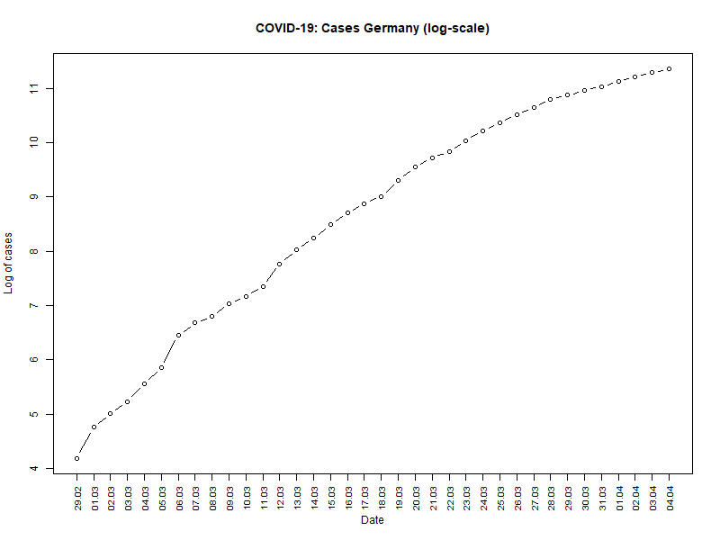
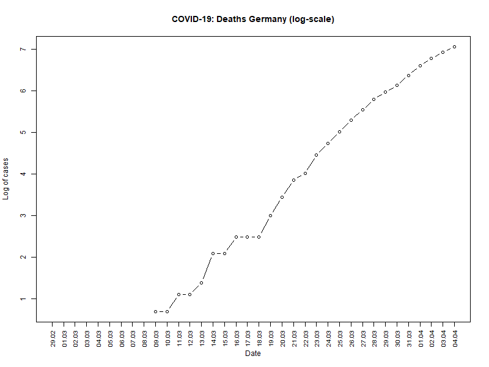
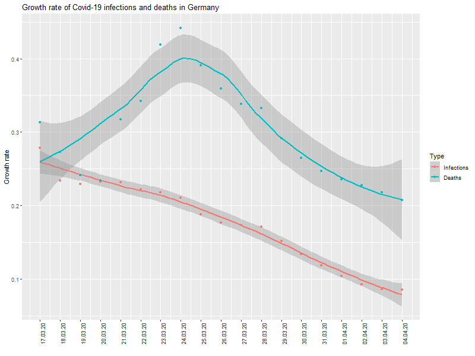

# COVID-19 Cases in Germany

Last update: 4 April 2020

This article presents a brief overview of the current development of COVID-19 cases in Germany. I investigate the rate of growth of newly discovered/reported infections in Germany and look at short term development of cases, assuming an unchanged growth rate. Find the R source code [here](https://github.com/Bixi81/COVID-19/blob/master/2020_04_04_covid19.R).

**1. Current Situation**

Data on known COVID-19 cases in Germany are currently published daily by the [Robert Koch-Institut (RKI)](https://www.rki.de/DE/Content/InfAZ/N/Neuartiges_Coronavirus/Fallzahlen.html).

**Find time series data on reported cases and deaths in Germany** [here](https://github.com/Bixi81/COVID-19/blob/master/2020-04-04_covid19_germany.csv). An overview of worldwide data sources can be found [here](https://opendata.stackexchange.com/questions/16185/covid19-coronavirus-case-data-country-summary-data).

Around 16 March 2020, first precautionary measures have been taken on a broader scale by German States (Bundesländer), including official recommendations to stay at home if possible and to avoid unnecessary travels. From 21 March 2020 onwards, stronger regulation is in place in two States (Bayern, Saarland), basically limitating freedom of movement for most people. 

Starting 23 March 2020, similar restrictions have been implemented all over Germany. These restrictions include a ban on gatherings of more than two people in the public. All restaurants and bars and most of shops are closed. All events are called off including sport events, concerts etc. Many factories are closed (including car makers such as Daimler, BMW, Volkswagen). Many office workers work from home. These restrictions will stay in force at least until 20 April 2020, according to the Bundesregierung (as of 28 March 2020).

The testing capacity in Germany is about 360,000 per week, according to the German ministry of health. About 10% of tested persons are tested positive (as of 28 March 2020).

As of 30 March, according to [Deutsche Krankenhausgesellschaft (DKG)](https://www.dkgev.de/dkg/coronavirus-fakten-und-infos/), 7000 people are treated in hospitals in Germany because of Covid-19 infections. 1500 of the 7000 are in intensive care and 1100 are treated using ventilators. Also according to the DKG, the capacity of intensive care in Germany before Covid-19 was 28000, 20000 of which with ventilators. As of 30 March, the capacity has been increased to 40000 with 30.000 ventilators. A newly installed register gives an overview of intensive care capacities in use: [DIVI Intensivregister](https://www.divi.de/register/intensivregister).

As of 31 March, the lethality of Covid-19 in Germany is about 0.8 percent according to RKI. The lethality is expected to increase within the next weeks in case more elderly are infected by Covid-19 and/or in case the number of treated patients rises. Information from South Korea imply that the lethality of Covid-19 is about 1.1%. The figure is based on broad testing in South Korea, which allows a relatively accurate assessment of the overall number of infections. After correction for the age distribution, the lethality observed in South Korea could translate to a lethality of about 1.3% in Germany.

As of 3 April, about 2300 of medical staff in German hospitals are infected with Covid-19, according to the Newspaper "Süddeutsche Zeitung" which cites RKI sources.

As of 4 April 2020, according to German [media reports](https://www.swr.de/swraktuell/corona-testkapazitaeten-gesteigert-100.html), the Covid-19 test capacity in Germany currently amounts to 100000 per day, compared to 7000 per day in early March. In South Korea, about 400000 people are tested daily.

5 April 2020: Germany's chancellery minister Helge Braun - according to media reports - says that new infections must not double in less than 10 to 14 days, in order for the German health sector, to cope with the number of patients. 

**2. Overall Trends**

On a semi-log scale, the number of newly discovered/reported infections keeps growing. However, there is a slight decrease of the growth rate over time on average.



Again on a semi-log scale, the number of reported deaths shows a relatively stable growth trend.




**3. Growth Rates**

The current growth of COVID-19 infections/deaths in Germany (last seven days) is estimated using a linear regression on the log of cases/deaths (y) with the number of days as independent variable (x). The estimation is based on the last seven days, to capture the current trend in newly discovered/reported infections.

=\beta_0&space;&plus;&space;\beta_1&space;x&space;&plus;&space;u.)

The regression results are:

**a) Infections**

```
Coefficients:
             Estimate Std. Error t value Pr(>|t|)    
(Intercept) 10.789396   0.003372    3200  < 2e-16 ***
ntime        0.082212   0.000754     109 1.23e-09 ***
---
Signif. codes:  0 ‘***’ 0.001 ‘**’ 0.01 ‘*’ 0.05 ‘.’ 0.1 ‘ ’ 1

Residual standard error: 0.00399 on 5 degrees of freedom
Multiple R-squared:  0.9996,	Adjusted R-squared:  0.9995 
F-statistic: 1.189e+04 on 1 and 5 DF,  p-value: 1.23e-09
```

**b) Deaths**

```
Coefficients:
            Estimate Std. Error t value Pr(>|t|)    
(Intercept) 5.787693   0.037300  155.16 2.11e-10 ***
ntime       0.188709   0.008341   22.62 3.14e-06 ***
---
Signif. codes:  0 ‘***’ 0.001 ‘**’ 0.01 ‘*’ 0.05 ‘.’ 0.1 ‘ ’ 1

Residual standard error: 0.04413 on 5 degrees of freedom
Multiple R-squared:  0.9903,	Adjusted R-squared:  0.9884 
F-statistic: 511.9 on 1 and 5 DF,  p-value: 3.135e-06
```

Between 2020-03-29 and 2020-04-04 the growth rate of newly discovered/reported infections was: 0.09.

Between 2020-03-29 and 2020-04-04 the growth rate of reported deaths was: 0.21.

Find a time series of growth rates [here](https://github.com/Bixi81/COVID-19/blob/master/2020-04-04_growth_covid19_germany.csv).

The figure below shows growth rates of newly discovered/reported infections/deaths (estimated over a seven day "lookback" period) over time.




**4. Prediction of Newly Discovered/Reported Infections and Reported Deaths**

Under the assumtion that the growth of newly discovered/reported infections/deaths will be unchanged (compared to last week), it is possible to predict the number of newly discovered/reported infections/deaths over the next few days. 

The figures below show actual cases/deaths (blue) and the predicted number of cases/deaths under the assumption of unchanged growth rate (red: linear OLS on semi-log scale).


**5. Deaths and Known Infections by Age**

[RKI](https://npgeo-corona-npgeo-de.hub.arcgis.com/datasets/dd4580c810204019a7b8eb3e0b329dd6_0) also provides patient-level data by county. Patient information include age groups. The data shows that most infected people are 35 to 59 years old (about 48%). In the age groups 60 to 79 (18%) and 80+ (6%), there are relatively few known cases.


However, when looking at deaths, the age groups 80+ (63%) and 60-79 years (31%) are extremely over-represented. This implies that - as of today - mostly older people die in consequence of a Covid-19 infection.


**6. Conclusion**

Stay at home!
